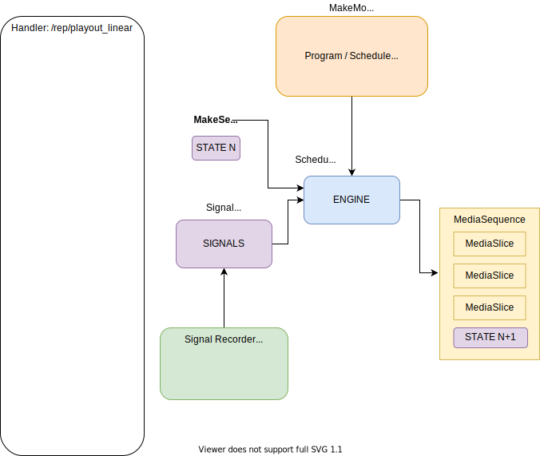

## Architecture Overview

## Design Notes

Metadata namespace: `/playout_linear`
(place all metadata under this key)

Single offering: `default`

Handler for `/rep/playout_linear`

- `/start` - called on a _write_token_
  - start LRO singal recorder - keep a pointer to it
  - record the start time and event
  - mark the object 'running' in the _write_token_ metadata

- `/stop` - called on the _write_token_
  - mark the object 'stopped' in the _write_token_ metadata

- manifest request
  - parse the *STATE* from the URL if present
  - create a Schedule object and call Schedule.MakeSequence(... *STATE* ...)
  - use the returned `MediaSequence` to create HLS/DASH manifest (live or on demand)

- segment request - *FAIL* (there should be no segments requests to this object)